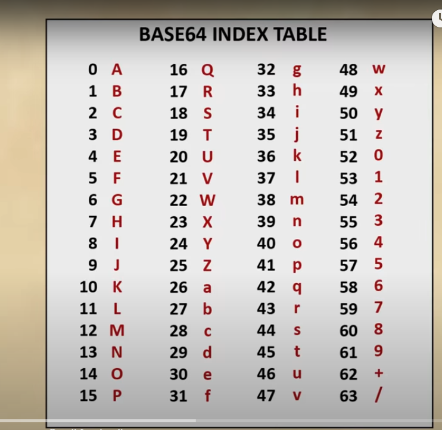

## using  webview:

const String kNavigationExamplePage = '''
<!DOCTYPE html><html>
<head><title>Navigation Delegate Example</title></head>
<body>
<p>
The navigation delegate is set to block navigation to the youtube website.
</p>
<ul>
<ul><a href="https://www.youtube.com/">https://www.youtube.com/</a></ul>
<ul><a href="https://www.google.com/">https://www.google.com/</a></ul>
</ul>
</body>
</html>
''';

here
In Flutter (and Dart), triple quotes ''' (single quotes) or """ (double quotes) are used to define multi-line string literals. They allow you to write strings that span multiple lines without needing to use newline characters (\n) or concatenate multiple strings together. This is particularly useful for embedding large chunks of text, such as HTML, JSON, or other formatted data, directly into your code.

## Usage :
The triple quotes allow you to embed the entire HTML content as a single string literal without needing to use escape sequences or concatenate multiple strings. This makes the code more readable and easier to manage.

Example Without Triple Quotes (for comparison):
```
const String kNavigationExamplePage = '<!DOCTYPE html>\n'
    '<html>\n'
    '<head>\n'
    '    <title>Navigation Delegate Example</title>\n'
    '</head>\n'
    '<body>\n'
    '<p>\n'
    '    The navigation delegate is set to block navigation to the youtube website.\n'
    '</p>\n'
    '<ul>\n'
    '    <ul><a href="https://www.youtube.com/">https://www.youtube.com/</a></ul>\n'
    '    <ul><a href="https://www.google.com/">https://www.google.com/</a></ul>\n'
    '</ul>\n'
    '</body>\n'
    '</html>';
```

LoadRequest method ()
